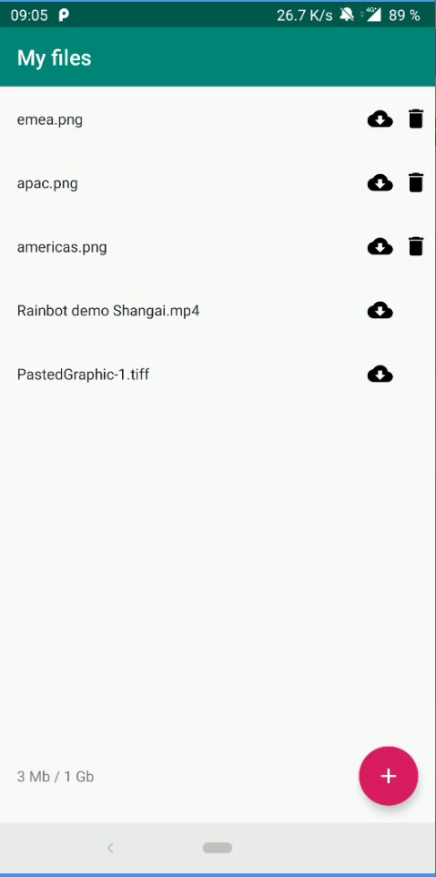
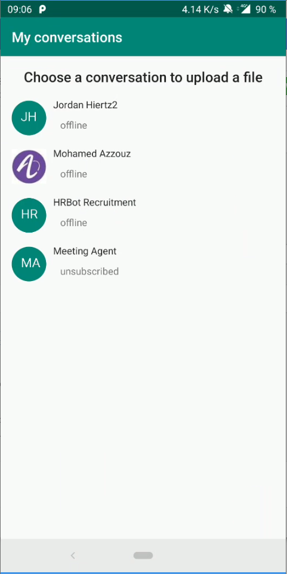

# Rainbow-Android-SDK-Samples / File Sharing
---

This sample uses the Rainbow SDK for Android to demonstrate how to manage file sharing.

To install this application, clone this repository and then, build and run it with Android Studio on your android mobile phone.

You must have a valid Rainbow account and application on sandbox to be able to login and test.

> please be sure to update `app\src\main\java\com\ale\filesharingdemo\App.java` according to your application  
> this sample works with the SDK version 1.60 and superior.

### Preview
---
File list | Add file
---|---
 | 

---