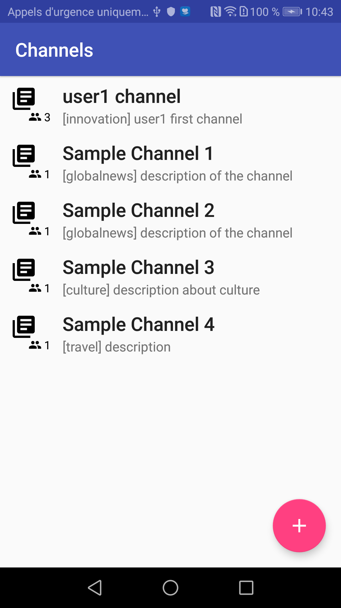
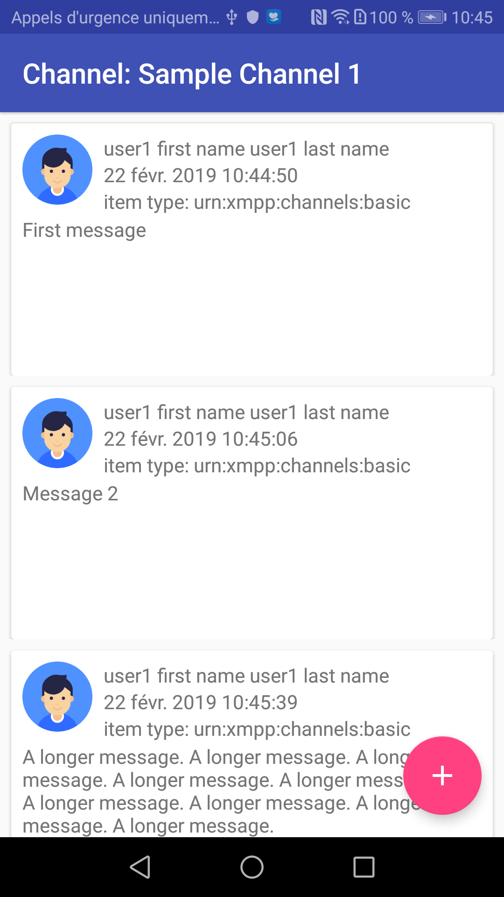
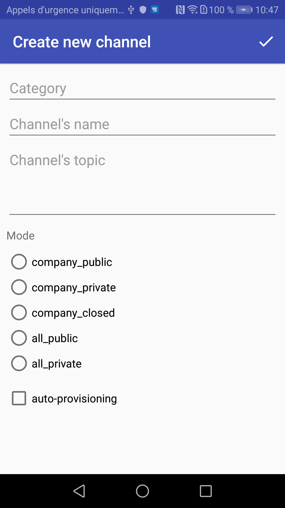

# Rainbow-Android-SDK-Samples / Channels

---

This sample uses the Rainbow SDK for Android to demonstrate how to manage channels.

To install this application, clone this repository and then, build and run it with Android Studio on your android mobile phone.

You must have a valid Rainbow account on sandbox to be able to login and test.

> this sample works with the SDK version 1.53 and superior.

## Preview

---
Channel list | Channel messages list | Create new channel
---|---|---
 |  | 

---
_Last updated December, 10th 2019_
