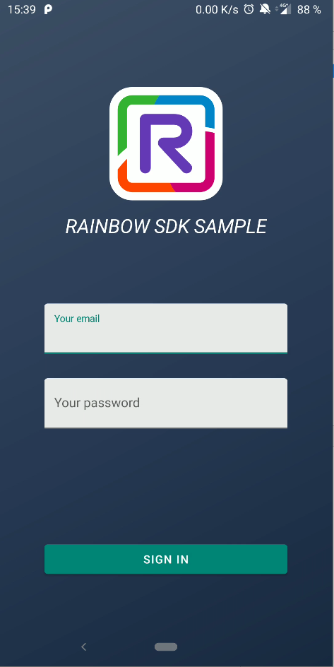

# Rainbow-Android-SDK-Samples / Conversations (Kotlin)

---

This sample uses the Rainbow SDK for Android

To install this sample, clone this repository and then, build and run it with Android Studio on your android mobile phone.

You must have a valid Rainbow account and application on sandbox to be able to login and test.

> Please, be sure to update `app\src\main\java\com\ale\conversations\App.kt` according to your application  
> This sample works with the SDK 1.64 and higher

## Preview

---

Login | Conversation list | Create bubble
---|---|---
 |  | 

Bubble conversation | Typing state | Bubble participants |
---|---|---
 | | 

Managing roster |
---|
