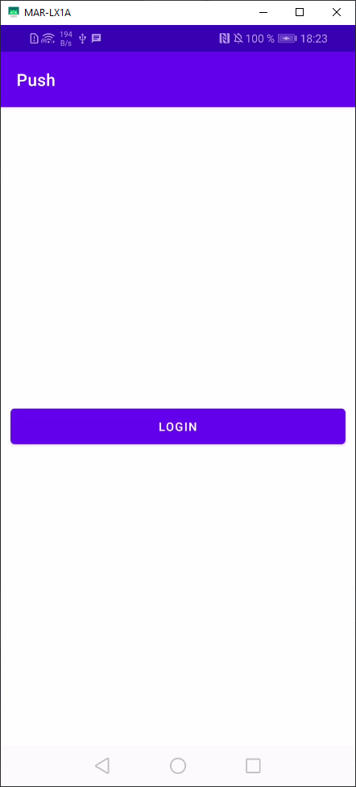
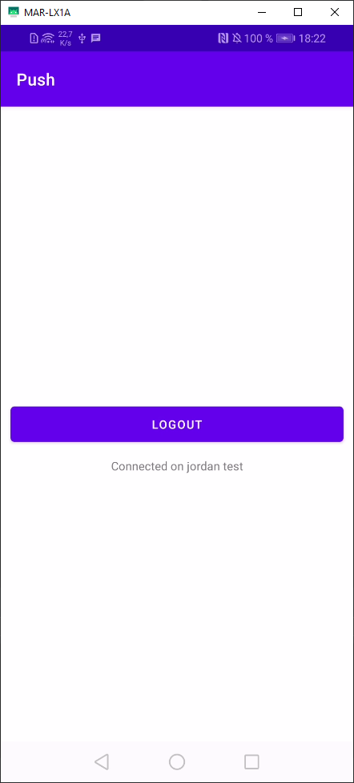
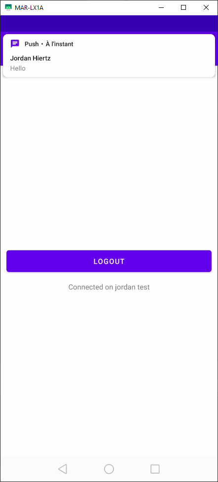
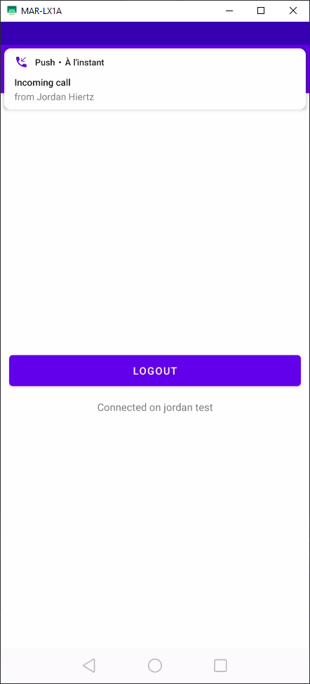
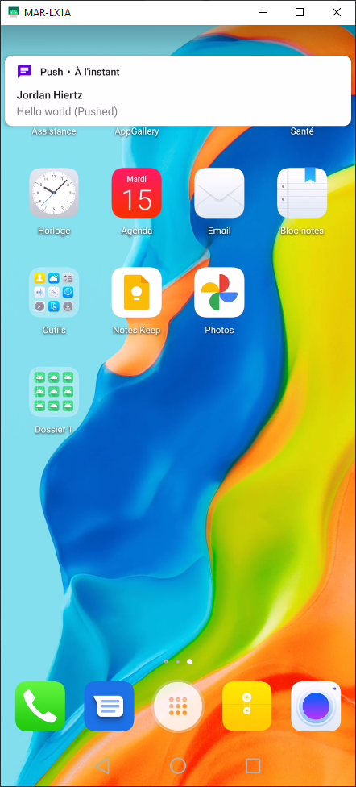

# Rainbow-Android-SDK-Samples / Conversations (Kotlin)

---

This sample uses the Rainbow Android SDK.

To install this sample, clone this repository and open the project with Android Studio.

You must have a valid Rainbow account and application on sandbox to be able to login and test.

> Please, be sure to update `app\src\main\java\com\ale\push\MyApplication.kt` according to your application  
> This sample works with the SDK 2.12.0 and higher

In addition, you must have a working push configuration to run this sample. To do so, you can follow [This link](https://hub.openrainbow.com/#/documentation/doc/sdk/android/lts/guides/Enabling_push_notifications "hub.openrainbow.com") to configure step by step the push notifications for your application.

After following the guide, you should have a `google-service.json` file at the root of your project. If you have correctly added the firebase server key and the firebase sender id in your application on the [dashboard](https://hub.openrainbow.com/#/dashboard/overview "hub.openrainbow.com") your push configuration is functional, you can install the sample on your smartphone.

## How to test

---

Login your user by replacing the login and password of the `MyApplication.kt class`. Launch the application and press the login button. You should see a message indicating that the connection was successful.

You can then send a message or call this user to see the notifications. After the application has switched to background mode, you will continue to see notifications through push.

## Preview

---

Main Activity | Login | Message notification
---|---|---
 |  | 

Incoming call notification | Message notification pushed
---|---
 | 
